# AYGO - Workshop 01

Cloud and virtualization using Docker and AWS workshop. 

This workshop contains 2 main projects:
* [Log Service](log-service/README.md)
* [Load Balancer](load-balancer/README.md)

Each project has its own README.md file with the instructions to build and run it.

## Technologies
* [Java 8](https://www.java.com/en/download/)
* [Maven](https://maven.apache.org/)
* [Docker](https://www.docker.com/)
* [AWS](https://aws.amazon.com/)

## Configuration of Docker images
More information for each project on their respective README.md files.

### Build an image
To build an image, go to the project folder and run the following command:
```
docker build --tag <image-name> .

ex: docker build --tag log-service .
```
On M1 mac use
```
docker build --platform linux/amd64 --tag <image-name> .
```

### Tag an image
To tag an image, run the following command:
```
docker tag <image-name> <user-name>/<image-name>:<tag>

ex: docker tag log-service jbenitezg/aygo1-log-service:1.1
```

### Push an image
To push an image, run the following command:
```
docker push <user-name>/<image-name>:<tag>

ex: docker push jbenitezg/aygo1-log-service:1.1
```

The image should be on the Docker Hub repository.

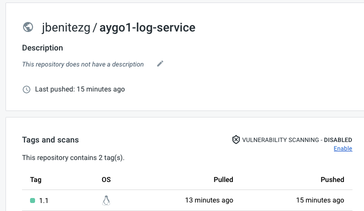

## Running on EC2

### Create an EC2 instance
To create an EC2 instance, go to the AWS console and select EC2.

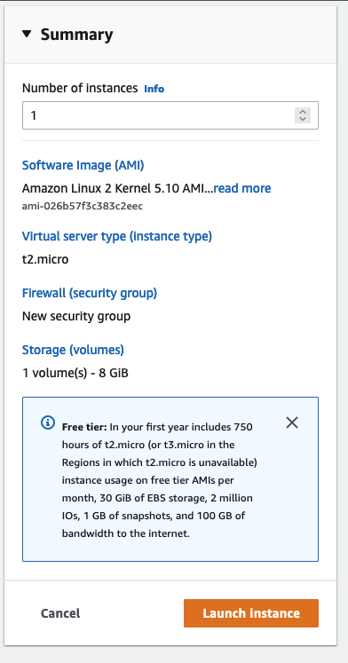
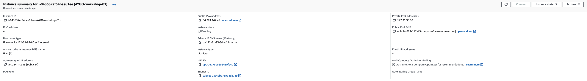

### Configure the security group to allow HTTP traffic
To allow HTTP traffic, go to the security group and add a new rule.

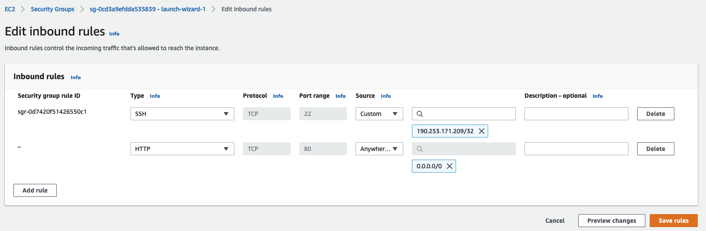

### Connect to the instance
To connect to the instance, go to the EC2 console and select the instance and click on the button "Connect".

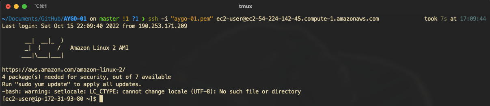

### Install Docker and Docker Compose
To install Docker and Docker Compose, run the following commands:

```bash
sudo yum update -y
sudo yum install docker -y
sudo curl -L https://github.com/docker/compose/releases/latest/download/docker-compose-$(uname -s)-$(uname -m) -o /usr/local/bin/docker-compose
sudo chmod +x /usr/local/bin/docker-compose
sudo service docker start
```

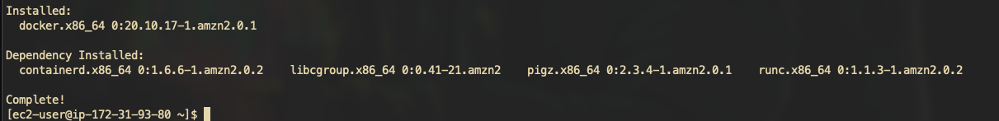

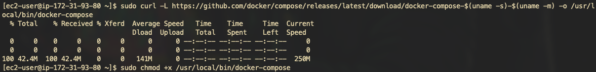

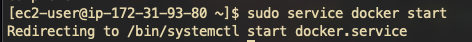

### Run the docker-compose.yml file
Copy the [docker-compose.yml](docker-compose.yml) file to the instance and run the following command:

```bash
docker-compose up
```

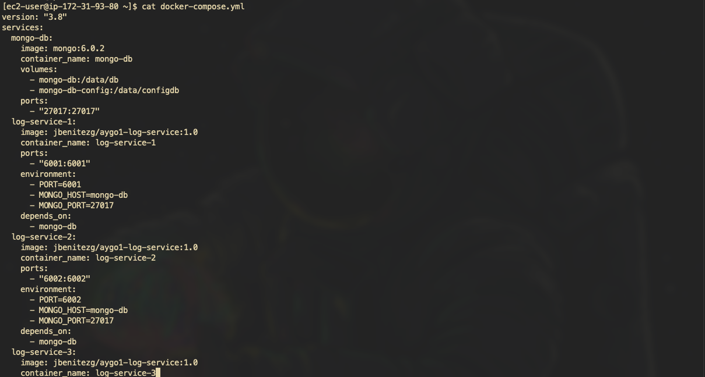

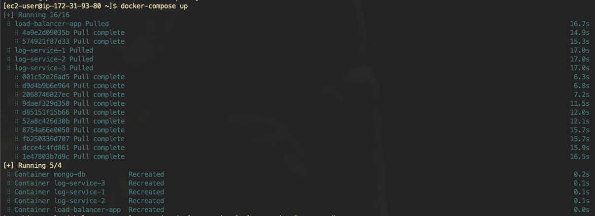

### Access the application
Using the ec2 instance public DNS, access the application.

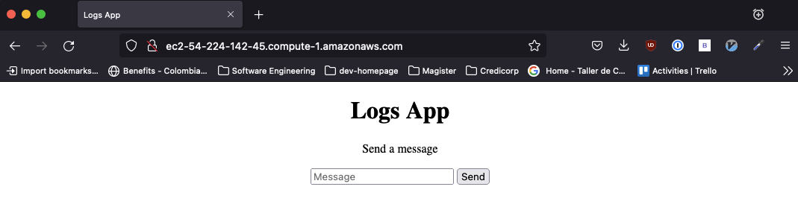

### Using the application

Send a message

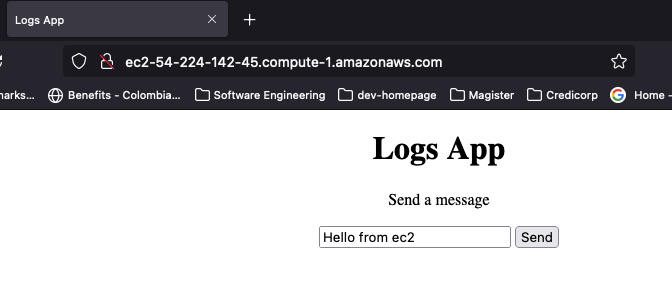

The response is in JSON format
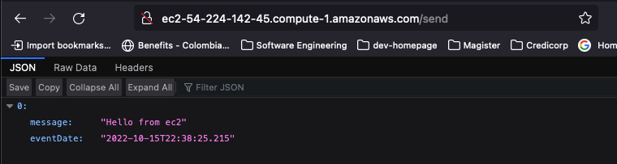

After three messages, the app makes a full round roubin as seen from the logs
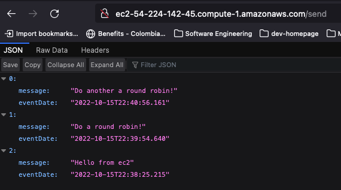

Server 1:
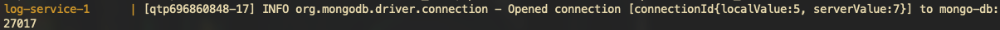

Server 2:
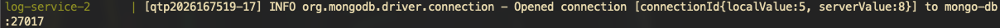

Server 3:
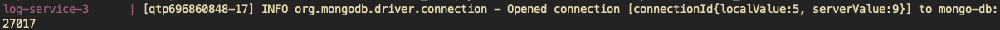

## Authors

* Julián Benítez Gutiérrez - *Development* - [julianbenitez99](https://github.com/julianbenitez99)
