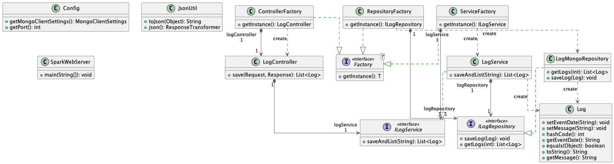

# Log Service

The service is a REST API developed in Spark that can be used to log messages to a mongo database.

## Class Diagram
The Log Service is also developed in Java using the micro-framework Spark, it provides a `LogMongoRepository` used to store and retrieve the messages.
The `LogService` class uses the interface `ILogRepository` to store and get the messages, and it's used in turn by the `LogController`. This service doesn't provide any web interface.



## Getting Started

These instructions will get you a copy of the project up and running on your local machine for development and testing
purposes.

### Pre-requisites

#### Java

Java 1.8 JDK is necessary, check if it is installed by typing in the command prompt `java -version` and `javac -version`
. The result should be similar to this:

```
java -version
java version "1.8.0_292"
Java(TM) SE Runtime Environment (build 1.8.0_241-b07)
Java HotSpot(TM) 64-Bit Server VM (build 25.241-b07, mixed mode)
```

If the command is not recognized, you can follow the instructions to install Java JDK
1.8 [here.](https://www.oracle.com/technetwork/java/javase/downloads/jdk8-downloads-2133151.html)

#### Maven

Maven is also necessary, you can check if it is installed by typing in the command prompt `mvn -v`. If installed, the
result should be similar to this.

```
mvn -v

Apache Maven 3.8.6 (84538c9988a25aec085021c365c560670ad80f63)
Maven home: /opt/homebrew/Cellar/maven/3.8.6/libexec
Java version: 1.8.0_292, vendor: AdoptOpenJDK, runtime: /Library/Java/JavaVirtualMachines/adoptopenjdk-8.jdk/Contents/Home/jre
Default locale: en_CO, platform encoding: UTF-8
OS name: "mac os x", version: "10.16", arch: "x86_64", family: "mac"
```

If the command is not recognized, you can follow the instructions to install
Maven [here.](https://maven.apache.org/install.html)

#### Docker

Docker is also necessary, you can check if it is installed by typing in the command prompt `docker -v`. If installed,
the result should be similar to this.

```
docker -v
Docker version 20.10.12, build e91ed57
```

If the command is not recognized, you can follow the instructions to install
Docker [here.](https://docs.docker.com/get-docker/)

#### MongoDB

A running instance of MongoDB is necessary.

### Installing

Clone the repository and go to the folder `AYGO-01/log-service`.

`git clone https://github.com/JulianBenitez99/AYGO-01.git`

To compile the project, in the command prompt type:

```
mvn clean install 
```

This downloads the dependencies needed for the project and executes the tests. After it finishes, the project it's ready
for it to be used.

### Running the Project Locally

In Windows or Linux, to run the web application type in the command prompt:

```
mvn exec:java
```

Access the web application in http://localhost:4567.

### Running the Project on Docker

#### Configuration

The configuration is made through environment variables, the following variables are available:

* `PORT`: Port where the application will be running, default value is `4567`.
* `MONGO_HOST`: Host of the MongoDB database, default value is `localhost`.
* `MONGO_PORT`: Port of the MongoDB database, default value is `27017`.

#### Execution

To run the project on Docker, first build the image with the following command:

* `docker build --tag log-service .`

Then, run the container with the following command:

* `docker run -p 80:4567 --name log-service-01 log-service`

Access the web application in http://localhost:80.

## Running the Tests

The project counts with an integration test for the `LogRepository` class. It can be run by typing in the command prompt:

```
mvn test
```

## Built With

* [Spark](http://sparkjava.com/) - Web Framework
* [Maven](https://maven.apache.org/) - Dependency Management

## Authors

* Julián Benítez Gutiérrez - *Development* - [julianbenitez99](https://github.com/julianbenitez99)